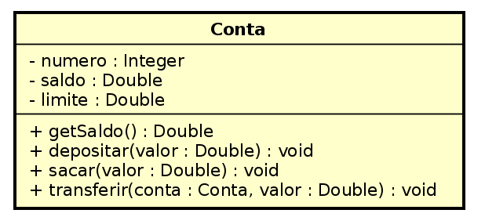

# Lista de Exercícios 02
**Observação**: 

Para executar todos os testes do pacote exercicios: 

```
$ ./gradlew test --tests exercicios.* --rerun-tasks`
```

As classes devem ser criadas nos diretórios/pacote:
 - classes: `/src/main/java/exercicios`
 - testes: `/src/test/java/exercicios`
 
### Exercício 01 - Implementar os métodos getters e setter nas classes `Quadrado`, `Retangulo` e `Circulo` 
1. Utilize como referência a classe `Conta` para implementar as validações e exceções
1. Implemente os testes correspondentes
1. Executar os testes:
    - `./gradlew test --tests exercicios.QuadradoTeste --rerun-tasks`
    - `./gradlew test --tests exercicios.CirculoTeste --rerun-tasks`
    - `./gradlew test --tests exercicios.CirculoTeste --rerun-tasks`
 
### Exercício 02 - Implementar os métodos getters e setter na classe `Correntista`

1. Utilize como referência a classe `Conta` para implementar as validações e exceções
1. Implemente os testes correspondentes
1. Executar os testes:
    - `./gradlew test --tests exercicios.CorrentistaTeste --rerun-tasks`
    
### Exercício 03 - Limite na Classe Conta

Adicione na classe Conta o atributo limite conforme apresentado no diagrama
abaixo. O limite indica o quanto pode ser sacado ou transferido além do saldo
disponível na conta. 

Exemplos:
1. Dado a Conta1 (numero = 1, saldo = 500.0, limite = 1000) 
    1. Após sacar(600.0) -> (numero = 1, saldo = -100.0, limite = 1000) 
    1. Após sacar(900.0) -> (numero = 1, saldo = -1000.0, limite = 1000) 
    1. Após sacar(100.0) -> (numero = 1, saldo = -1000.0, limite = 1000) -> Não permite o saque e lança uma exceção

1. Implemente os testes correspondentes aos métodos set e get limite
1. Refatorar os testes para considerar o limite
1. Executar os testes:
    - `./gradlew test --tests exercicios.ContaTeste --rerun-tasks`



